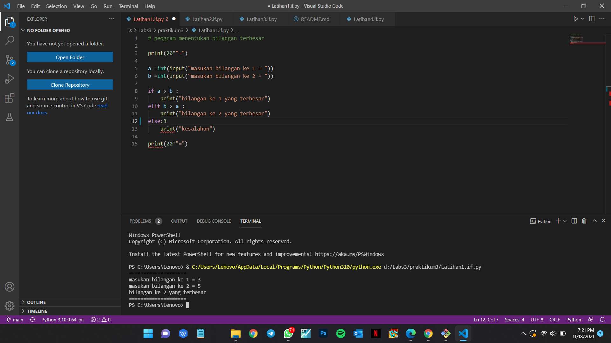
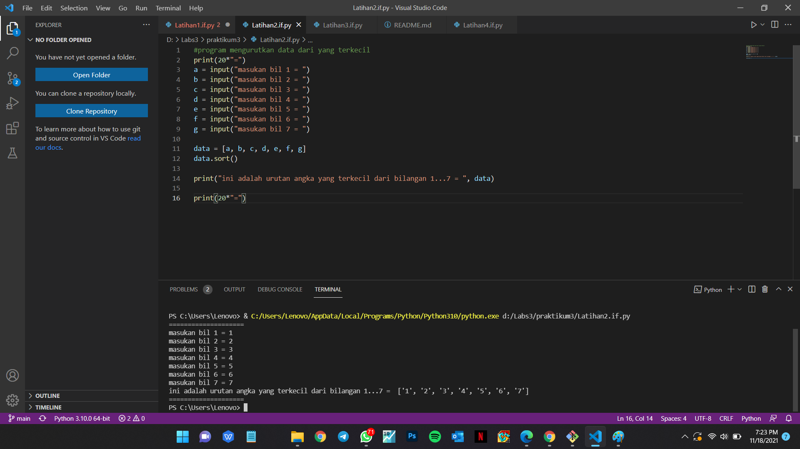
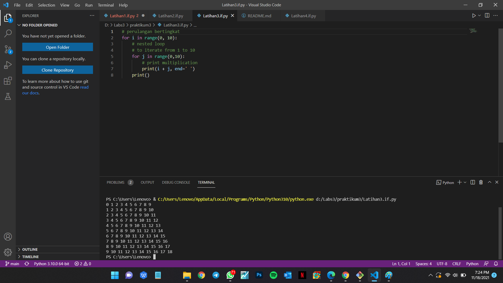
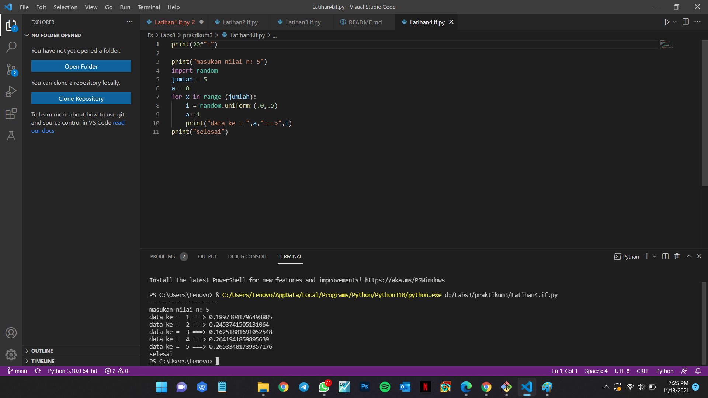

# praktikum3

## Latihan1
-menentukan bilangan terbesar dari 2 bilangan yang di input kan

-program ini di buat menggunakan kondisi if, elif dan else

-dan program ini juga menggunakan operator pembanding
 

 ## Latihan2
 -mengurutkan data dari yang terkecil dari beberapa inputan

 -program ini di buat terdiri dari banyak inputan dan list

 -program ini menggunakan selection sort (untuk menentukan data dari yang terkecil)
 

 ##Latihan 3
 -membuat program perulangan bertingkat (nested) for

 -program ini di buat menggunakan perulangan/looping (for)

 -range yang merupakan jarak / batasan

 -nested loop adalah membuat program perulangan di dalam perulangang
 

 ## Latihan4
 -Tampilkan n bilangan acak yang lebih kecil dari 0.5.

 -program ini di buat menggunakan while loop dan for loop
 
 -import random mempunya fungsi menampilkan nilai / huruf acak
 